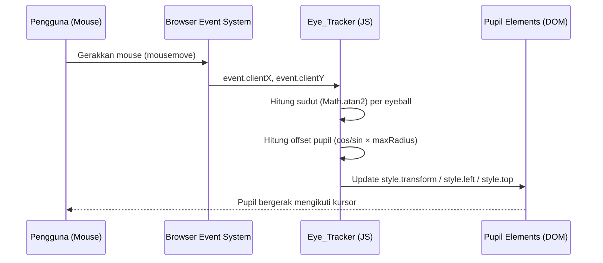

# Design Document: Cat Eye Cursor Tracker

## Overview

Fitur ini adalah halaman web interaktif (`index.html`) yang menampilkan ilustrasi wajah kucing berbasis HTML/CSS. Kedua mata kucing memiliki pupil yang bergerak mengikuti posisi kursor mouse secara real-time menggunakan JavaScript vanilla.

Tujuan utama:
- Memberikan pengalaman visual yang menarik dan interaktif
- Berjalan sepenuhnya di sisi klien tanpa backend
- Menggunakan Tailwind CSS CDN untuk styling dan JavaScript vanilla untuk logika interaktif

### Keputusan Desain Utama

1. **Ilustrasi berbasis HTML/CSS** — Wajah kucing dibangun dari elemen `<div>` dengan Tailwind CSS, bukan SVG atau gambar eksternal. Ini memudahkan manipulasi DOM dan positioning pupil.
2. **Kalkulasi posisi pupil dengan trigonometri** — Menggunakan `Math.atan2` untuk menghitung sudut antara pusat eyeball dan posisi kursor, lalu `Math.cos`/`Math.sin` untuk menentukan offset pupil dalam batas radius eyeball.
3. **Single-file delivery** — Seluruh HTML, CSS (via Tailwind CDN), dan JavaScript berada dalam satu file `index.html`.

---

## Architecture

Aplikasi ini adalah single-page static web app tanpa framework. Arsitekturnya sangat sederhana:

```
index.html
├── <head>        — meta, title, Tailwind CDN link
├── <body>        — layout + cat illustration markup
└── <script>      — Eye_Tracker logic (mousemove handler)
```

### Alur Data



---

## Components and Interfaces

### 1. HTML Structure

```
body
└── main.container          — flex center, full viewport height
    └── div.cat-face        — kepala kucing (rounded, background)
        ├── div.cat-ears    — dua telinga (segitiga CSS)
        ├── div.eyes-row    — baris mata
        │   ├── div.eyeball.left   — bola mata kiri
        │   │   └── div.pupil      — pupil kiri
        │   └── div.eyeball.right  — bola mata kanan
        │       └── div.pupil      — pupil kanan
        ├── div.nose        — hidung kucing
        └── div.mouth       — mulut kucing
```

### 2. Eye_Tracker Module (JavaScript)

**Interface:**

```javascript
// Inisialisasi setelah DOMContentLoaded
function initEyeTracker() { ... }

// Handler utama dipanggil setiap mousemove
function onMouseMove(event) {
    // event.clientX, event.clientY → posisi kursor
    updatePupil(leftEyeball, leftPupil, event.clientX, event.clientY);
    updatePupil(rightEyeball, rightPupil, event.clientX, event.clientY);
}

// Hitung dan terapkan posisi pupil
function updatePupil(eyeball, pupil, cursorX, cursorY) {
    // 1. Dapatkan bounding rect eyeball
    // 2. Hitung pusat eyeball
    // 3. Hitung sudut dengan Math.atan2
    // 4. Hitung maxRadius = (eyeball.radius - pupil.radius)
    // 5. Terapkan offset: left = centerX + cos(angle) * maxRadius
    //                     top  = centerY + sin(angle) * maxRadius
}
```

**Kalkulasi Inti:**

```
eyeCenterX = rect.left + rect.width / 2
eyeCenterY = rect.top  + rect.height / 2

angle     = Math.atan2(cursorY - eyeCenterY, cursorX - eyeCenterX)
maxRadius = (eyeball.offsetWidth / 2) - (pupil.offsetWidth / 2)

pupilX = eyeCenterX + Math.cos(angle) * maxRadius
pupilY = eyeCenterY + Math.sin(angle) * maxRadius

// Terapkan sebagai posisi absolut di dalam eyeball
pupil.style.left = (pupilX - rect.left - pupil.offsetWidth / 2) + 'px'
pupil.style.top  = (pupilY - rect.top  - pupil.offsetHeight / 2) + 'px'
```

### 3. Fallback State

Ketika `mousemove` tidak tersedia (atau sebelum event pertama), pupil berada di tengah eyeball (posisi default CSS: `left: 50%; top: 50%; transform: translate(-50%, -50%)`).

---

## Data Models

Tidak ada data model persisten. Semua state adalah ephemeral DOM state.

### Runtime State

| State | Tipe | Deskripsi |
|---|---|---|
| `cursorX` | `number` | `event.clientX` dari mousemove terakhir |
| `cursorY` | `number` | `event.clientY` dari mousemove terakhir |
| `eyeball.getBoundingClientRect()` | `DOMRect` | Posisi dan ukuran eyeball di viewport |
| `pupil.style.left` | `string (px)` | Posisi horizontal pupil di dalam eyeball |
| `pupil.style.top` | `string (px)` | Posisi vertikal pupil di dalam eyeball |

### Konstanta Desain Visual

| Konstanta | Nilai | Deskripsi |
|---|---|---|
| Cat face size | `~280px` | Lebar/tinggi wajah kucing |
| Eyeball diameter | `~60px` | Diameter bola mata |
| Pupil diameter | `~24px` | Diameter pupil |
| Max pupil travel | `(30 - 12) = 18px` | Radius maksimum pergerakan pupil |

